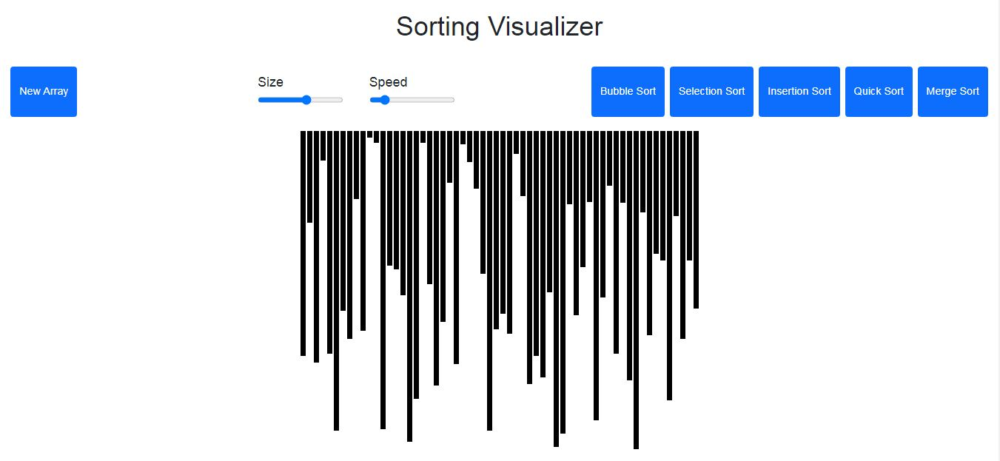
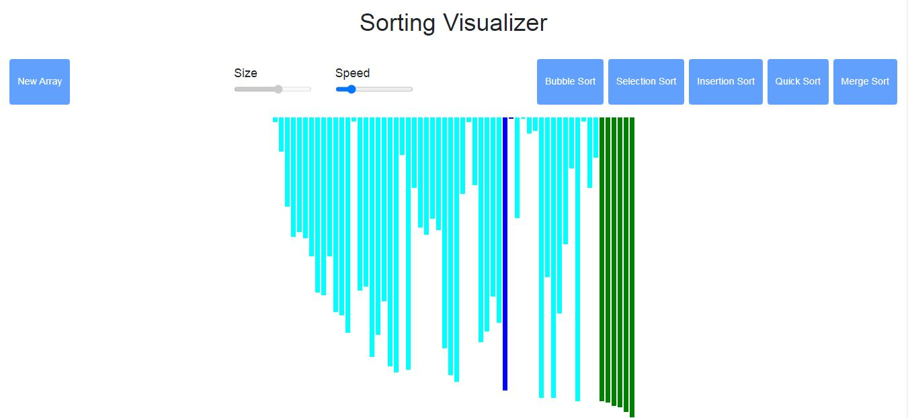
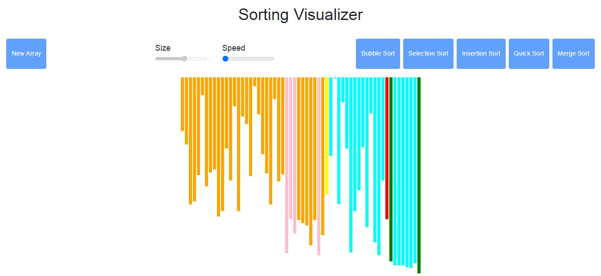
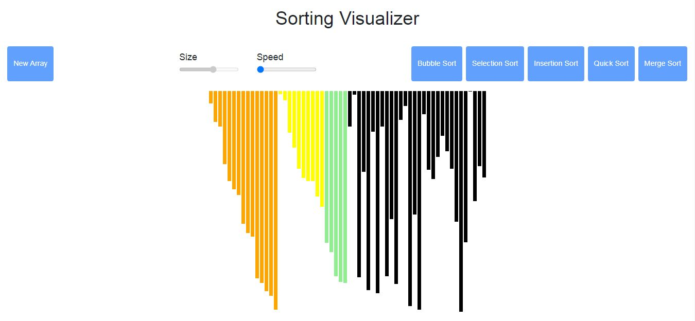

# Sorting Visualizer
Visualizer is a web app for visualizing a bunch of different sorting algorithms Like Selection Sort, Bubble Sort, Insertion Sort, Merge Sort, Quick Sort, Heap Sort With the functionality of (Speed Control) and (Array Size Control).

## Project Specifications
There are 5 sorting algorithms are visualized

- Bubble Sort 
- Selection Sort
- Insertion Sort
- Quick Sort
- Merge Sort

## Live Demo
- [Sorting Visualizer](https://omkarkanade.github.io/Sorting-Visualizer/)

## Screenshots

