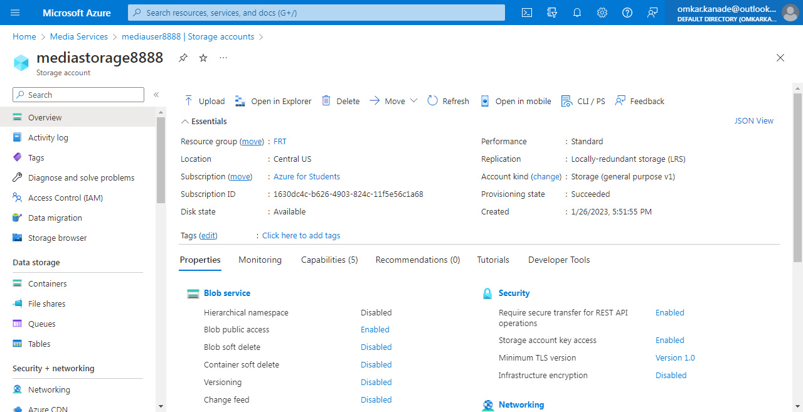

# Sorting Visualizer
Visualizer is a web app for visualizing a bunch of different sorting algorithms Like Selection Sort, Bubble Sort, Insertion Sort, Merge Sort, Quick Sort, Heap Sort With the functionality of (Speed Control) and (Array Size Control).

## Project Specifications
There are 5 sorting algorithms are visualized

- Bubble Sort 
- Selection Sort
- Insertion Sort
- Quick Sort
- Merge Sort

## Demo Video
- [Sorting Visualizer](https://omkarkanade.github.io/Sorting-Visualizer/demo.html)

## Live Demo
- [Sorting Visualizer](https://omkarkanade.github.io/Sorting-Visualizer/)

## Azure Services

## Static Web App

## Media Services

### Media User

### Media Storage

### Working Demo Video

## Screenshots

